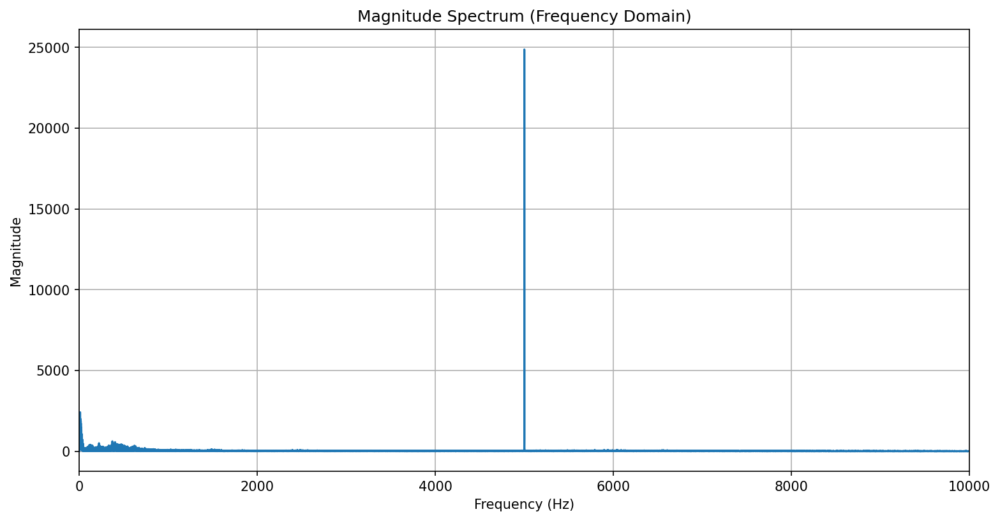
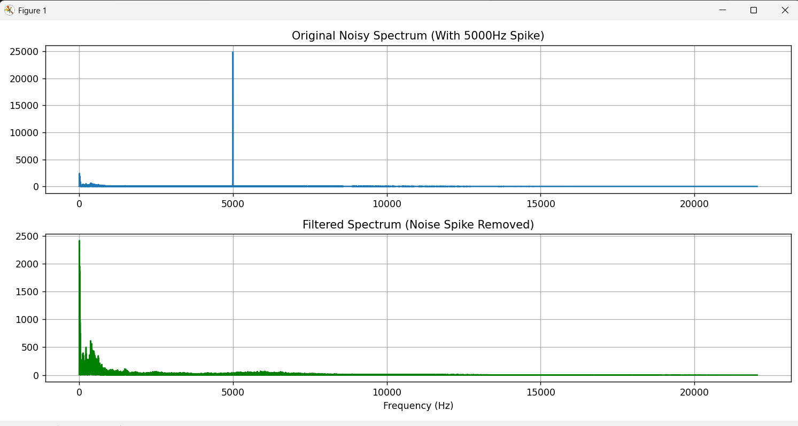

# Audio Denoising via Fourier Transform (Signals & Systems)

This project demonstrates the practical application of the **Fourier Transform** in Digital Signal Processing (DSP). It focuses on identifying and removing additive high-frequency noise from a speech signal using frequency-domain masking.

## 📌 Project Overview
In many real-world scenarios, audio signals are corrupted by narrow-band interference (e.g., electrical hum or high-pitched whistling). This project implements a **Notch Filter** in the frequency domain to surgically remove noise without distorting the underlying audio.

**Core Course Concepts Applied:**
* Sampling and Nyquist-Shannon Theorem ($f_s = 44.1$ kHz).
* Signal Superposition ($y[n] = x[n] + \eta[n]$).
* Discrete Fourier Transform (DFT) via the Fast Fourier Transform (FFT) algorithm.
* Frequency-selective filtering (Notch Filtering).
* Signal Reconstruction via Inverse FFT (IFFT).

---

## 🛠️ Mathematical Implementation

### 1. The Fourier Transform
The signal is moved from the **Time Domain** to the **Frequency Domain** using:
$$X(f) = \int_{-\infty}^{\infty} x(t) e^{-j 2 \pi f t} dt$$

### 2. The Filter Design

We identify the noise spike at $f_{noise} = 5000$ Hz in the magnitude spectrum and apply a frequency mask:

$$H(f) = \begin{cases} 
0 & \text{if } f \in [f_{noise} \pm \Delta] \\ 
1 & \text{otherwise} 
\end{cases}$$

### 3. Reconstruction
The filtered spectrum is transformed back to the time domain:
$$x_{clean}(t) = \mathcal{F}^{-1} \{ X(f) \cdot H(f) \}$$

---

## 📊 Results

### Frequency Domain Analysis
| Before Filtering | After Filtering |
| :---: | :---: |
|  |  |

**Observation:** The noise "spike" at 5000Hz was approximately 10x the magnitude of the speech signal. By setting the coefficients to zero, we effectively eliminated the interference.

---

## 🚀 How to Run
1. **Clone the repository:**
   ```bash
   git clone [https://github.com/your-username/Fourier-Denoising-SS.git](https://github.com/your-username/Fourier-Denoising-SS.git)
